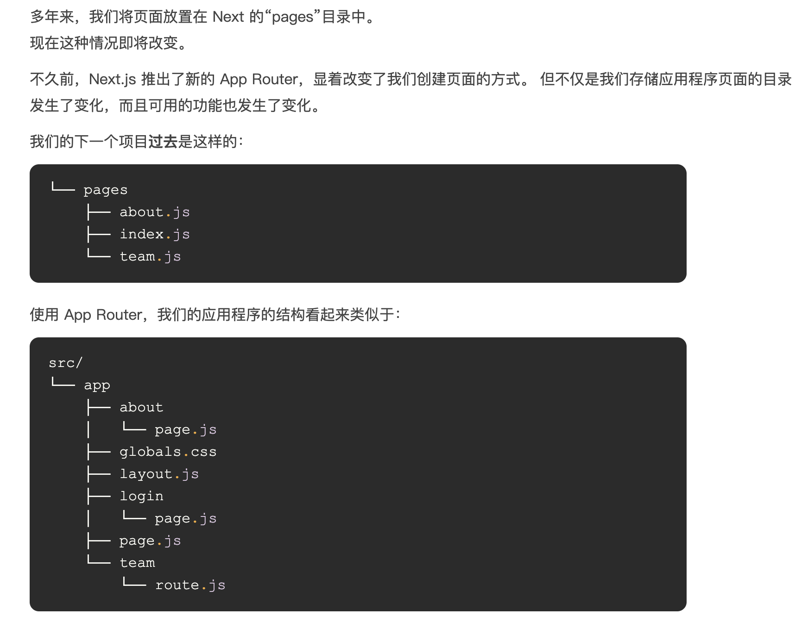

This is a [Next.js](https://nextjs.org/) project bootstrapped with [`create-next-app`](https://github.com/vercel/next.js/tree/canary/packages/create-next-app).

## nextjs

- Nextjs 是一个使用 react 作为前端框架底层的支持 SSR（请求时渲染）、SSG（构建时渲染）等技术的全栈框架
- 默认使用 SSR
- 默认都是服务器组建，不能使用客户端功能。可以在文件顶部使用"use client"声明为客户端组建
- nextjs@12 之后，默认使用了 Next.js Compiler，使用 Rust【SWC】写的。

## 性能优化问题

react 更新问题：

> 1、当组件更新，会连带着更新所有的子组件，除非子组件处理了 SCU

> > 1.1 只要子组件接收了 props.xxx，即使没有使用，当 xxx 发生变更，也会触发 rerender

优化方向：

> 1、排除不必要的 props：这一部分是为了解决不必要的 props 发生了变更，引起的 rerender 问题
>
> 2、对组件做 SCU：这一部分是为了解决必须的 props 未发生变化引起的 rerender 问题

## 集成 whydidyourender

```plain
1、安装依赖：npm install @welldone-software/why-did-you-render --save-dev
2、如果使用了automatic JSX transfomation，要确保preset-react是development模式，并配置importSource
    [
        '@babel/preset-react', {
            runtime: 'automatic',
            development: process.env.NODE_ENV === 'development',
            importSource: '@welldone-software/why-did-you-render'
        }
    ]
```

3、创建 wdyr.js 文件
4、在入口页引入 wdyr.js

- 方案一：增加 tsconfig.json 或者 jsconfig.json 配置 jsxImportSource

## 目录结构

> nextjs 原生不支持 hash 路由，如果要使用 hash 路由需要使用第三方库：next-hash-routes

```plain
    - app：AppRouter
        - layout：布局
        - page：页面
        - loading：加载界面
        - not-found：未找到界面
        - error：错误界面
        - global-error：全局错误界面
        - route：API端点
        - template：重新渲染的布局
        - default：并行路由回退页面
    - pages：PagesRouter
    - components：
    - public：静态资源文件
    - src：可选用的应用程序源代码文件夹
```

- src/pages/\_app.tsx：自定义入口文件
- src/pages/\_document.tsx：自定义页面

## 应用路由和页面路由

[参考资料](https://www.cnblogs.com/eddyz/p/17621208.html)

> 在 Next.js 13 之前，Pages Router 是在 Next.js 中创建路由的主要方式。它使用直观的文件系统路由将每个文件映射到路由。新版本的 Next.js 仍然支持 Pages Router，但我们建议迁移到新的 应用路由 以利用 React 的最新功能
>
> App Router 中可用的新功能
> 1、默认情况下，应用程序目录中的任何组件现在都是服务器组件。服务器组件在服务器上呈现。 他们的所有代码都保留在服务器上 - 这意味着我们无法使用客户端功能，例如窗口对象或 React 中的典型钩子。 服务器组件缺乏与客户端的交互性。可以通过在文件顶部声明“使用客户端”来声明客户端组件。
>
> 2、布局更简单
>
> 3、layout.js 文件，它可以位于每个路径的目录中
>
> Page
> 

## Getting Started

First, run the development server:

```bash
npm run dev
# or
yarn dev
# or
pnpm dev
# or
bun dev
```

Open [http://localhost:3000](http://localhost:3000) with your browser to see the result.

You can start editing the page by modifying `app/page.tsx`. The page auto-updates as you edit the file.

This project uses [`next/font`](https://nextjs.org/docs/basic-features/font-optimization) to automatically optimize and load Inter, a custom Google Font.

## Learn More

To learn more about Next.js, take a look at the following resources:

- [Next.js Documentation](https://nextjs.org/docs) - learn about Next.js features and API.
- [Learn Next.js](https://nextjs.org/learn) - an interactive Next.js tutorial.

You can check out [the Next.js GitHub repository](https://github.com/vercel/next.js/) - your feedback and contributions are welcome!

## Deploy on Vercel

The easiest way to deploy your Next.js app is to use the [Vercel Platform](https://vercel.com/new?utm_medium=default-template&filter=next.js&utm_source=create-next-app&utm_campaign=create-next-app-readme) from the creators of Next.js.

Check out our [Next.js deployment documentation](https://nextjs.org/docs/deployment) for more details.
